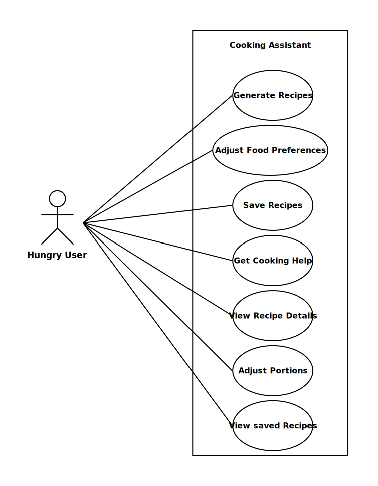
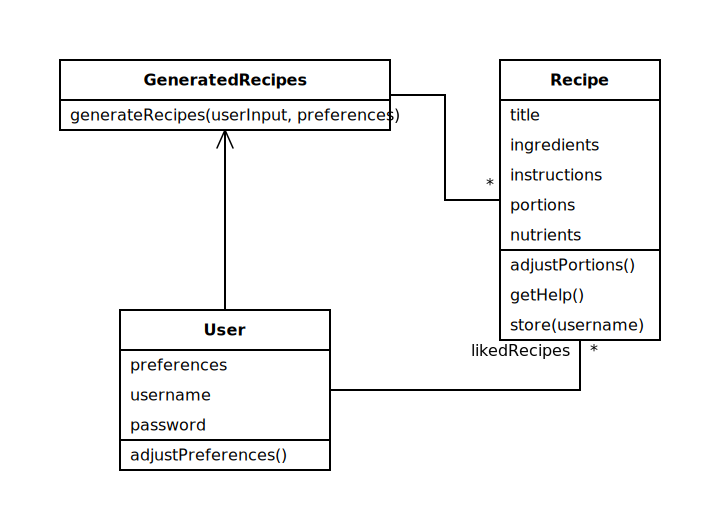
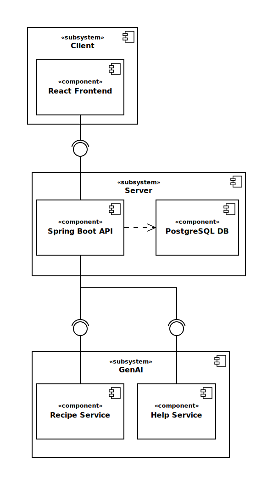

# Cooking Assistant (Team DevSecOps)

## Try it out!

Rancher deployment (Kubernetes): https://devsecops.stud.k8s.aet.cit.tum.de

Azure deployment (Docker Compose): http://4.223.70.80/

Coverage reports: https://aet-devops26.github.io/team-devsecops/

Public API scheme (Swagger UI): https://devsecops.stud.k8s.aet.cit.tum.de/swagger-ui/index.html

Monitoring (Grafana): https://devsecops.stud.k8s.aet.cit.tum.de/grafana

## Setup Guide

All components of the project can be deployed locally through the `docker-compose.yml` at the root level.
In order to use the AI features, run the following command to copy the template for the environment variable setup.

```bash
cp .env.example .env
```
Now edit `.env`: Specify your API provider and insert your API keys. Then run

```bash
docker compose watch # watch enables live rebuild on src changes
```

This starts
- the web client: http://localhost:8080
- the Spring API: http://localhost:8081
- the GenAI services on the internal network
- SwaggerUI: http://localhost:8083 (switch to the internal API spec using the dropdown in the top right corner)

## Architecture

### Use case diagram



### Analysis object diagram



### System component diagram




### Repository Overview

```text
team-devsecops/
├── .github/                    # CI/CD workflows
├── ansible/                    # Playbooks for CD to Azure VM
├── api/
    ├── scripts/gen-all.sh       # Auto generate models for api specs
    ├── openapi-internal.yaml   # Internal API spec
    ├── openapi.yaml            # Public API spec
├── infra/                      # Terraform and K8s configuration
├── services/
│   ├──py-help-service/         # Help-Service source code
│   ├──py-recipe-service/       # Recipe-Service source code
│   ├──spring-api/              # Server source code
├── web-client/                 # Client source code
├── .env.example
└── docker-compose.yml
```

## API docs

The public API specification is documented at `api/openapi.yaml`.
It provides the communication contract between the client and the server.
The internal communication protocol between the server and the GenAI Services is documented at `api/openapi-internal.yaml`.
In particular it specifies how user information is appended to client requests.
Both specs can be viewed through SwaggerUI at:

https://devsecops.stud.k8s.aet.cit.tum.de/swagger-ui/index.html

http://localhost:8083 (while the system is running locally)

Models implementing the specified schemas can be autogenerated by running `./api/scripts/gen-all.sh`.

## CI/CD and monitoring instructions

The `.github/` directory contains various workflows for running lint and test jobs, building the components and deploying them.
Deployments are triggered when merging branches into `main`.
If you want to contribute please install pre-commit using `pipx install pre-commit` and set up the pre-commit hooks using `pre-commit install`.

### Deployment to Azure VM

IaC configurations are provided to simplify the deployment to Azure.
The following commands allow a reproducible instantiation of a suitable VM.

```bash
cd infra            # Navigate to IaC configurations
az login            # Login to Azure
terraform init      # Initialize working directory
terraform plan      # Generates an execution plan
terraform apply     # Executes plan - requires manual confirmation
```

The github actions workflow `.github/workflows/deploy-ansible.yml` triggers the execution of the Ansible playbook `ansible/site.yml`.
The playbook connects to the VM via ssh, clones the repository and deploys all components including a nginx instance via the `infra/docker-compose.yml`.
Before running the workflow make sure to set up all necessary repository variables and secrets.
These are: `SSH_PRIVATE_KEY` (SSH-Key to Azure-VM),  `GEMINI_MODEL`, `GEMINI_HELP_SERVICE_KEY`, `GEMINI_RECIPE_SERVICE_KEY`, `INTERNAL_AUTH_SECRET` (Authentication between Server and GenAI Services), `AZURE_DB_USER` and `AZURE_DB_PASSWORD`.

### K8s Deployment & Monitoring

The production environment is hosted on the TUM CIT Kubernetes cluster (managed via Rancher) using a GitOps-style approach.

*   **Deployment Architecture & Setup:** The cluster state is defined declaratively in `infra/k8s/`, with an Ingress controller routing external traffic to `web-client`, `spring-api` and the GenAI services. Deploying from scratch is three steps:

    ```bash
    cp infra/k8s-secrets.env.example infra/k8s-secrets.env   # then fill it in
    kubectl apply -f infra/k8s/namespace.yaml
    infra/k8s-secrets.sh && kubectl apply -R -f infra/k8s/
    ```
*   **CI/CD Pipeline:** Deployments are fully automated. When code is merged into the `main` branch, a GitHub Actions workflow validates the code, containerizes the updated components, pushes the images to the registry, and automatically rolls out the changes to the Rancher cluster.
*   **Observability & Monitoring:** We utilize a Prometheus and Grafana stack to ensure system reliability. The Spring API and GenAI services expose metrics endpoints (e.g., via Spring Boot Actuator) that Prometheus scrapes.
*   **Live Dashboards:** System health, resource utilization, and API latencies are visualized and can be monitored in real-time through our [Live Grafana Dashboards](https://devsecops.stud.k8s.aet.cit.tum.de/grafana).

## Student Responsibilities

| Role | Name |
| :--- | :--- |
| Client | Jakob |
| Server | David |
| GenAI | Paul |
